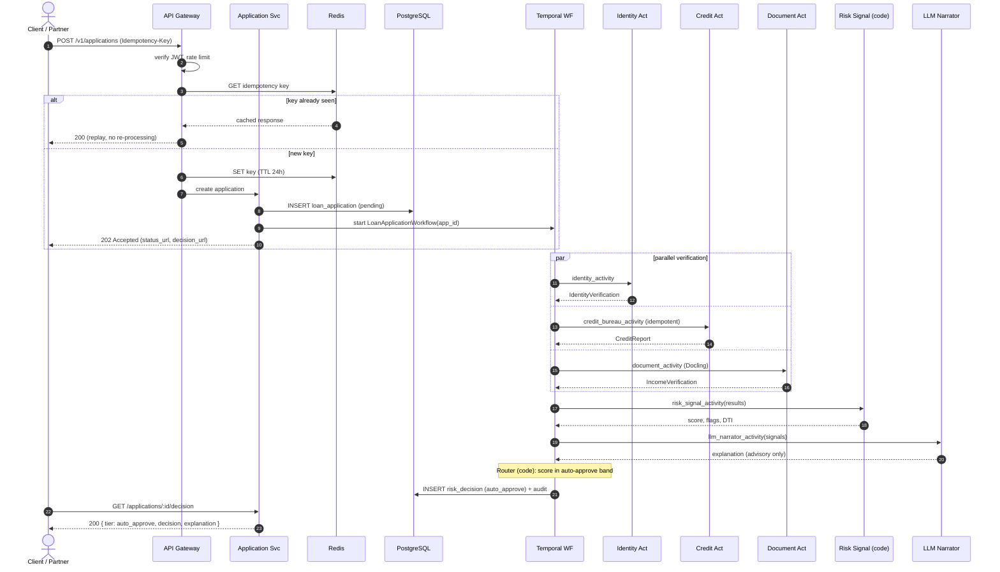
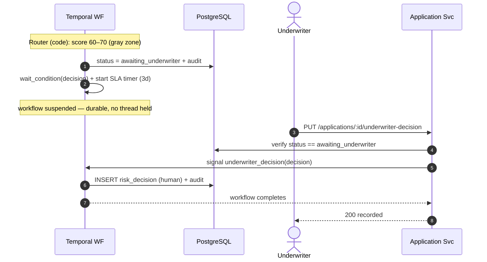
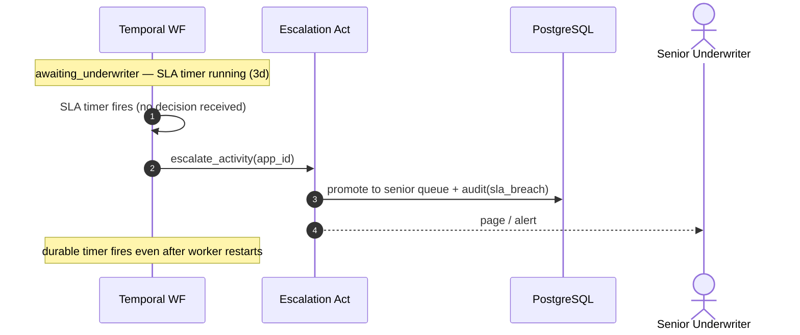
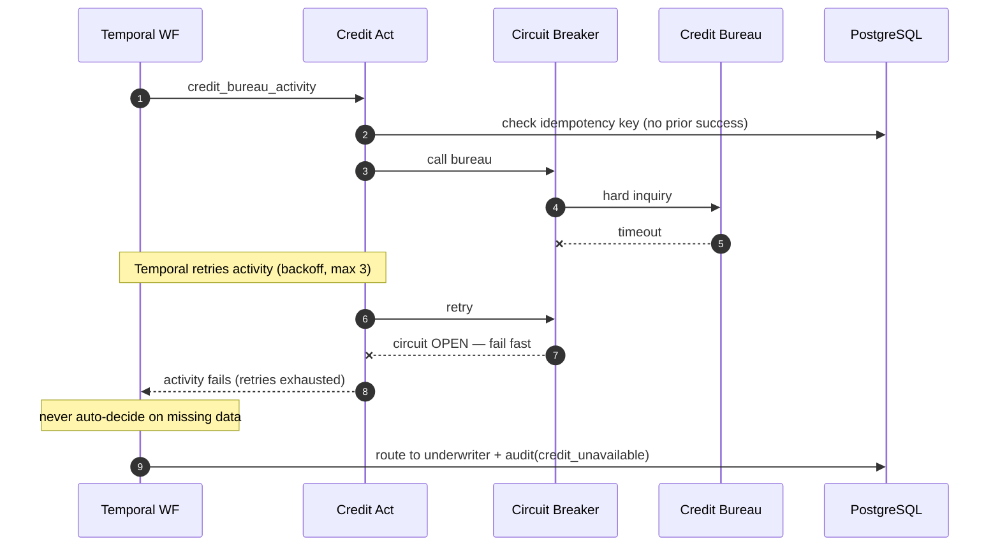
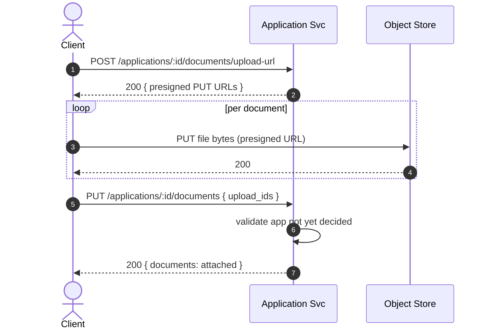
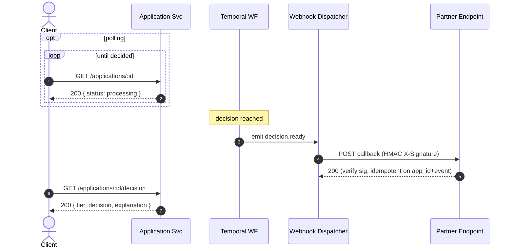
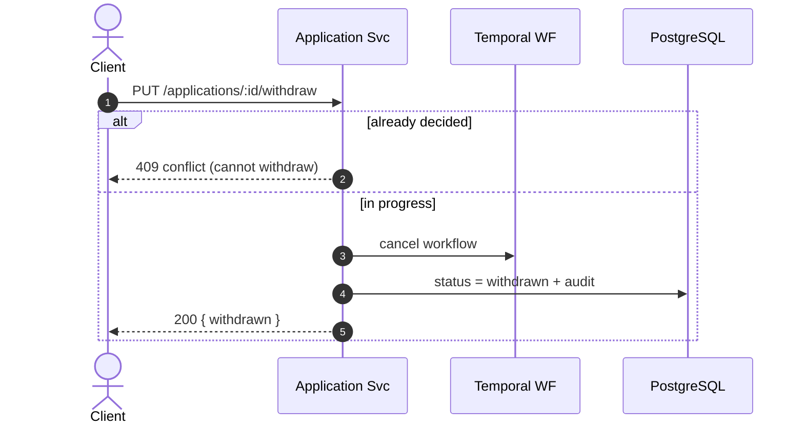

# System Design: Multi-Step Risk-Aware Loan Application Router

## Table of Contents

- [Problem Statement](#problem-statement)
- [Requirements](#requirements)
- [Capacity Estimation](#capacity-estimation)
- [Core Entities](#core-entities)
- [API Design](#api-design)
- [Infrastructure Choices](#infrastructure-choices)
- [High-Level Architecture](#high-level-architecture)
- [Data Flow & Services](#data-flow--services)
- [Sequence Diagrams](#sequence-diagrams)
- [Agentic AI Components](#agentic-ai-components)
- [Data Model](#data-model)
- [Test & Evaluation Framework](#test--evaluation-framework)
- [Observability / Debuggability / Telemetry](#observability--debuggability--telemetry)
- [Deep Dives](#deep-dives)
- [Fault Analysis / Edge Cases](#fault-analysis--edge-cases)
- [Tradeoffs Summary](#tradeoffs-summary)

---

## Problem Statement

Design a multi-step, risk-aware loan application processing system for a financial
services platform operating at 1M applications/day. The system must validate
applicant identity, assess creditworthiness, verify income documentation, check
regulatory compliance by loan type and state, and route each application to the
appropriate decision lane — all with full auditability, no duplicate credit pulls on
retry, and compliance with FCRA, ECOA, and state lending regulations.

---

## Requirements

### Functional Requirements

- Accept loan applications with supporting documents (ID, pay stubs, bank statements)
- Verify applicant identity against government-issued ID
- Pull credit score and tradeline summary from a credit bureau
- Extract and validate income and employment from uploaded documents
- Compute debt-to-income (DTI) ratio
- Check regulatory rules by loan type and state
- Flag fraud indicators and sanctions/watchlist hits
- Route to one of three lanes: auto-approve, human underwriter queue, deny + compliance log
- Return a human-readable explanation with every decision
- Track application status throughout processing

### Non-Functional Requirements

| Property | Target / Notes |
|----------|---------------|
| Latency | Submission ACK < 200ms; full processing p50 < 30s, p95 < 90s, p99 < 3min |
| Availability | 99.95% — active-active across two regions |
| Consistency | Strong for decision records — financial compliance, no stale reads on outcomes |
| Scalability | 1M applications/day (~12 avg req/s; 60–120 req/s peak burst 5–10×) |
| Durability | RPO = 0 for decision records and audit log |
| Idempotency | Credit pulls, document processing must not re-execute on retry |
| Security & Compliance | GLBA, ECOA, FCRA, state lending regs; full append-only audit trail |
| Fault Tolerance | No single point of failure; partial verification results must never produce a decision |

### Out of Scope

- Loan servicing (post-approval payments, collections)
- Origination document generation (e-sign flow)
- Credit bureau integration internals

---

## Capacity Estimation

```
1M applications/day
  → ~12 req/s average
  → ~60–120 req/s peak (5–10× burst)

Each application fans out to 3 parallel verification calls:
  → ~36 req/s average to downstream services at steady state
  → ~360 req/s peak

Storage (decisions + audit log):
  ~1M rows/day × 365 = ~365M rows/year
  Each row ~2KB → ~730GB/year raw; partition by month

Queue throughput:
  ~12 jobs/s in, ~12 jobs/s out (workers must keep up at peak)
  Worker pool: size to handle 120 jobs/s peak with headroom
```

---

## Core Entities

| Entity | Key Fields | Notes |
|--------|-----------|-------|
| `LoanApplication` | id, applicant_id, loan_type, amount, state, status, created_at | Top-level aggregate |
| `LoanApplicationDetails` | application_id, ssn_encrypted, stated_income, employment_type, employer, stated_address, loan_purpose, submitted_at | Raw applicant-submitted form data — PII, encrypted at rest |
| `Applicant` | id, name, dob, ssn_hash, address | PII — encrypted at rest |
| `IdentityVerification` | application_id, status, confidence, provider_ref | Result of checking stated identity against ID provider |
| `CreditReport` | application_id, score, dti, tradelines, pulled_at | Bureau result — independent of what applicant stated |
| `IncomeVerification` | application_id, gross_income, employment_type, verified_at | Extracted from uploaded documents — compared against stated income |
| `RiskDecision` | application_id, score, tier, flags, explanation, decided_at | Output of risk synthesis agent |
| `AuditLog` | application_id, event, actor, timestamp, payload_hash | Append-only; never updated |

---

## API Design

**Interface style:** REST/JSON over HTTPS — resource-oriented, CRUD maps cleanly,
well understood by integrating partner systems. Processing is async, so submission
returns **`202 Accepted`** and the caller either **polls** `GET` or subscribes to a
**webhook** for the terminal decision.

**Endpoint-surface review.** The original five (`POST /applications`,
`GET /applications/:id`, `GET …/decision`, `PUT …/documents`, `PUT …/withdraw`)
cover only the applicant happy path. They are **not enough** — the design already
depends on endpoints that weren't exposed. Added below:

| Added endpoint | Why it's required |
|----------------|-------------------|
| `PUT …/underwriter-decision` | Referenced in Data Flow step 7 + the Temporal signal, but was never in the API surface. Without it the HIL loop can't close. |
| `POST …/documents/upload-url` | Files can't go in a JSON body; partners need presigned upload URLs before attaching. |
| `GET /applications` | Partner portals + underwriter queues need list/search with pagination. |
| `GET …/audit` | Compliance/underwriter need the append-only audit trail per application. |
| `POST /webhooks` (+ outbound callbacks) | Submission is `202`; polling forever is wasteful — partners need push on `decision.ready`. |

### Conventions (all endpoints)

- **Base path:** `/v1`. **Auth:** JWT (RS256); claims carry `tenant_id`, `sub`,
  and `roles`. Applicant routes require `role:applicant` scoped to their own
  `applicant_id`; `underwriter-decision`/`audit` require `role:underwriter` (or
  `compliance`).
- **Idempotency:** `Idempotency-Key` (UUID) required on `POST /applications`.
  Same key + same body → original response replayed (no re-processing); same key +
  different body → `409`. Keys in Redis, TTL 24h.
- **PUT over PATCH** for updates where retries matter (not guaranteed idempotent).
- **Pagination:** cursor-based — `?cursor=&limit=` (limit ≤ 100) → `next_cursor`.
- **Rate limit:** `429 Too Many Requests` + `Retry-After` header.
- **Error envelope** (every 4xx/5xx):

```json
{ "error": { "code": "validation_failed", "message": "amount_cents must be > 0",
             "fields": { "amount_cents": "must be > 0" }, "trace_id": "a1b2c3" } }
```

### Applicant / partner endpoints

**`POST /v1/applications`** — submit a new application.
Headers: `Authorization`, `Idempotency-Key`.

```jsonc
// Request
{
  "loan_type": "mortgage",            // personal | mortgage | auto
  "amount_cents": 35000000,
  "state": "CA",
  "loan_purpose": "home_purchase",
  "applicant": {
    "first_name": "Sarah", "last_name": "Johnson",
    "dob": "1985-04-12",
    "ssn": "xxx-xx-xxxx",             // TLS in transit; tokenized server-side, never logged
    "email": "sarah@example.com", "phone": "+14155550123",
    "stated_income_cents": 12000000,
    "employment_type": "employed",    // employed | self_employed | unemployed | retired
    "employer_name": "NeuralFlow AI",
    "stated_address": { "line1": "1 Main St", "city": "SF", "state": "CA", "zip": "94105" }
  },
  "documents": [                       // optional: attach previously uploaded files
    { "type": "pay_stub", "upload_id": "up_9f..." },
    { "type": "bank_statement", "upload_id": "up_3k..." }
  ]
}
```

```jsonc
// 202 Accepted  (accepted for async processing)
{
  "application_id": "app_7Yk2...",
  "status": "pending",
  "status_url":   "/v1/applications/app_7Yk2.../",
  "decision_url": "/v1/applications/app_7Yk2.../decision",
  "created_at": "2026-07-05T18:02:11Z"
}
```

| Status | When |
|-------:|------|
| `202` | Accepted for processing |
| `200` | Idempotent replay (same key+body) — returns the original `202` body |
| `400` | Malformed body / schema violation |
| `401` | Missing/invalid JWT |
| `409` | `Idempotency-Key` reused with a different body |
| `422` | Semantically invalid (unsupported `state`×`loan_type`, amount ≤ 0) |
| `429` | Rate limited (`Retry-After`) |

**`GET /v1/applications/:id`** — poll status.

```jsonc
// 200 OK
{
  "application_id": "app_7Yk2...",
  "status": "processing",             // pending | processing | awaiting_underwriter | decided | withdrawn
  "current_stage": "credit_pull",     // last completed / in-flight workflow step
  "loan_type": "mortgage", "amount_cents": 35000000, "state": "CA",
  "decision_available": false,
  "created_at": "2026-07-05T18:02:11Z", "updated_at": "2026-07-05T18:02:29Z"
}
```
`401` · `403` (not your application) · `404`.

**`GET /v1/applications/:id/decision`** — decision + explanation.

```jsonc
// 200 OK  (only when decided)
{
  "application_id": "app_7Yk2...",
  "tier": "underwriter",              // auto_approve | underwriter | deny
  "decision": "approved",            // approved | denied | pending_review
  "score": 61.0,
  "flags": ["stated_income_mismatch:+24%", "employment_type_conflict"],
  "explanation": "Application scores 61/100. DTI within limits, no fraud indicators…",
  "adverse_action_reasons": [],       // populated (FCRA/ECOA) when decision = denied
  "rule_version": "reg-v2.3",
  "decided_at": "2026-07-05T18:04:40Z",
  "decided_by": "underwriter:u_88"    // or "system" for auto lanes
}
```
`401` · `403` · `404` · **`409 decision_not_ready`** (still processing — body carries `status` + `Retry-After`).

**`POST /v1/applications/:id/documents/upload-url`** — get presigned upload URLs.

```jsonc
// Request
{ "documents": [ { "type": "pay_stub" }, { "type": "bank_statement" } ] }
// 200 OK
{ "uploads": [
  { "type": "pay_stub", "upload_id": "up_9f...", "url": "https://s3…/PUT?sig=…", "expires_at": "…" },
  { "type": "bank_statement", "upload_id": "up_3k...", "url": "https://s3…/PUT?sig=…", "expires_at": "…" }
] }
```
Client `PUT`s bytes directly to each `url`. `401` · `403` · `404`.

**`PUT /v1/applications/:id/documents`** — attach/replace the document set (idempotent — full replace).

```jsonc
// Request
{ "documents": [ { "type": "pay_stub", "upload_id": "up_9f..." },
                 { "type": "bank_statement", "upload_id": "up_3k..." } ] }
// 200 OK
{ "application_id": "app_7Yk2...", "documents": [
  { "type": "pay_stub", "upload_id": "up_9f...", "status": "attached" },
  { "type": "bank_statement", "upload_id": "up_3k...", "status": "attached" } ] }
```
`400` (unknown `upload_id`) · `404` · **`409`** (application already `decided` — docs frozen).

**`PUT /v1/applications/:id/withdraw`** — applicant withdraws (idempotent).

```jsonc
// Request
{ "reason": "applicant_request" }
// 200 OK
{ "application_id": "app_7Yk2...", "status": "withdrawn", "withdrawn_at": "…" }
```
`403` · `404` · **`409`** (already `decided` — cannot withdraw). Repeat withdraw of an
already-withdrawn app returns `200` (idempotent).

**`GET /v1/applications`** — list/search (partner + underwriter).
Query: `status`, `loan_type`, `state`, `applicant_id`, `from`, `to`, `cursor`, `limit`.

```jsonc
// 200 OK
{ "items": [ { "application_id": "app_7Yk2...", "status": "awaiting_underwriter",
               "loan_type": "mortgage", "amount_cents": 35000000, "created_at": "…" } ],
  "next_cursor": "eyJvIjoxMDB9" }
```

### Underwriter / compliance endpoints

**`PUT /v1/applications/:id/underwriter-decision`** — submit the human decision
(idempotent). Requires `role:underwriter`. Sends a Temporal **signal** to the
suspended workflow.

```jsonc
// Request  (underwriter identity comes from the JWT, not the body)
{
  "decision": "approved",             // approved | denied
  "reason": "Income sources verified via 2023 tax return.",
  "conditions": ["proof_of_reserves"],       // optional approval conditions
  "adverse_action_reasons": []               // REQUIRED (non-empty) when decision = denied
}
// 200 OK
{ "application_id": "app_7Yk2...", "status": "decided", "decision": "approved",
  "recorded_at": "…" }
```

| Status | When |
|-------:|------|
| `200` | Decision recorded, workflow resumed |
| `400` | `denied` without `adverse_action_reasons` (ECOA/FCRA) |
| `403` | Caller is not an underwriter / not assigned |
| `404` | Application not found |
| `409` | Not in `awaiting_underwriter` (workflow already completed / SLA-escalated) — signal to a closed workflow is rejected |

**`GET /v1/underwriter/queue/stream`** — **SSE** live feed of applications entering
`awaiting_underwriter` plus SLA-warning events, for the assigned underwriter's open
dashboard. `role:underwriter`. One-way server→client; the decision itself is the separate
`PUT …/underwriter-decision` (SSE carries no client→server channel). Falls back to polling
`GET /v1/applications?status=awaiting_underwriter` when SSE is unavailable.

```jsonc
// event: queued
// data:
{ "application_id": "app_7Yk2...", "tier": "underwriter", "sla_due_at": "…",
  "amount_cents": 35000000, "state": "CA", "queued_at": "…" }
// event: sla_warning
// data: { "application_id": "app_7Yk2...", "sla_due_at": "…", "minutes_left": 30 }
```

**`GET /v1/applications/:id/audit`** — append-only audit trail. `role:underwriter|compliance`.

```jsonc
// 200 OK
{ "application_id": "app_7Yk2...", "events": [
  { "event": "submitted",       "actor": "applicant",        "ts": "…", "payload_hash": "…" },
  { "event": "credit_pull",     "actor": "system",           "ts": "…", "payload_hash": "…" },
  { "event": "routed:underwriter","actor": "system",         "ts": "…", "payload_hash": "…" },
  { "event": "underwriter_decision","actor": "underwriter:u_88","ts":"…","payload_hash": "…" } ] }
```

### Webhooks (async completion)

**`POST /v1/webhooks`** — register a callback (per tenant).

```jsonc
// Request
{ "url": "https://partner.example.com/hooks/loans",
  "events": ["decision.ready", "status.changed"],
  "secret": "whsec_…" }        // used to HMAC-sign deliveries
// 201 Created
{ "webhook_id": "wh_1a...", "events": ["decision.ready","status.changed"], "active": true }
```

**Outbound delivery** (system → partner), signed `X-Signature: sha256=…` (HMAC over
body with the shared secret; partner must verify):

```jsonc
// POST <registered url>
{ "event": "decision.ready", "application_id": "app_7Yk2...",
  "tier": "auto_approve", "decision": "approved", "decided_at": "…" }
```
Delivery is **at-least-once** with retries + exponential backoff; consumers must be
idempotent on `application_id`+`event`.

### Notification & real-time transport (rationale)

Process lifetime here spans **seconds to days** (instant auto-decisions vs a 3-day
underwriter SLA), so each channel is matched to *who is watching and for how long* —
never a socket held across a human step.

| Consumer | Transport | Why |
|----------|-----------|-----|
| Applicant UI | `GET …/:id` + `…/decision` **polling** (`Retry-After`) | status is checked on-demand; a days-pending app must not pin a connection |
| Applicant / partner **system** | **Webhooks** (`decision.ready`, signed, retried) | server-to-server; at-least-once + idempotent so a decision is never missed |
| Underwriter queue | **SSE** (`…/queue/stream`) + `PUT` decision | one-way live queue push while the dashboard is open; the action is a separate request |
| Internal step→step | **Temporal / Kafka** (not a client transport) | orchestration, not notification |

**Deliberately not used:** WebSockets — the only client→server action is an occasional
underwriter decision (a plain `PUT`), so there's no bidirectional traffic to justify a
stateful socket + backplane; and **long-held streams across the multi-day SLA** — the
anti-pattern of coupling a connection's lifetime to a long-running process. The durable
state (Postgres + Temporal) is the source of truth; every client channel is a reconcilable
view over it (a reconnect resyncs via a plain `GET`).

---

## Infrastructure Choices

| Component | Choice | Notes |
|-----------|--------|-------|
| Database | PostgreSQL (partitioned) | ACID, pgvector, monthly range partitions |
| Message Queue | Kafka | High throughput intake; partitioned by state |
| Cache | Redis | Idempotency keys, rate limit counters, hot config |
| Workflow Engine | **Temporal** | Durable multi-step pipeline + HIL waits + SLA timers |
| Rate Limiter | Token bucket per tenant | Redis-backed; 429 + Retry-After on breach |
| Circuit Breaker | Per external dependency | One breaker each for bureau, ID provider, doc processor |

---

## High-Level Architecture

```
[Client / Partner Portal]
        │
        ▼
[API Gateway]  — JWT auth, rate limiting (token bucket, Redis), idempotency key check
        │
        ▼
[Application Service]  — writes LoanApplication (status: pending)
        │                 starts Temporal workflow execution
        ▼
[Temporal Workflow: LoanApplicationWorkflow]
        │
        ├─── [parallel activities] ───────────────────────────────────┐
        │         │                      │                            │
        ▼         ▼                      ▼                            ▼
 [Identity      [Credit Bureau      [Document Processing        (extensible:
  Activity]      Activity]           Activity — Docling]         background checks)
  L1 structured  L1 structured       L1 structured
  output         output              output
        │
        └─── [all three results assembled] ──▶ [Risk Signal Activity]  — code
                                                  dti, rules, fraud, anomalies, score
                                                          │
                                                          ▼
                                                  [LLM Narrator Activity]  — L1 single call
                                                  explanation field only; no routing effect
                                                          │
                                                          ▼
                                                     [Router Activity]  — code
                                                     ├─ auto-approve → workflow completes
                                                     ├─ gray zone → workflow suspends
                                                     │               waits for signal
                                                     │               SLA timer running
                                                     │     ◀── underwriter_decision signal
                                                     │               workflow resumes
                                                     └─ hard fail → deny + audit log
```

---

## Data Flow & Services

1. Client submits `POST /applications`. API Gateway validates JWT, checks
   `Idempotency-Key` in Redis, applies rate limit. Returns `202 Accepted` immediately.
2. Application Service writes `LoanApplication` (status: `pending`) and **starts a
   Temporal workflow execution** (`LoanApplicationWorkflow`, keyed by `application_id`).
3. Temporal workflow **dispatches three activities in parallel** (genuinely independent):
   - **IdentityActivity** — calls ID provider; writes `IdentityVerification`. Retried
     automatically by Temporal with backoff on failure.
   - **CreditBureauActivity** — pulls score + tradelines; writes `CreditReport`.
     Idempotency key checked before bureau call — Temporal activity retries are safe
     because the key prevents a second hard inquiry.
   - **DocumentActivity** — Docling over uploaded files; writes `IncomeVerification`.
4. Workflow waits for all three activities. If any exhaust retries → workflow routes
   directly to HIL (underwriter), never auto-decides on missing data.
5. **RiskSignalActivity** (code) computes all signals deterministically: DTI ratio,
   regulatory rule check, fraud indicator lookup, anomaly flags, composite score.
   **LLMNarratorActivity** (L1 — single model call, no tool loop) receives the structured
   signals and produces the `explanation` field only. The explanation is advisory —
   it does not affect score, tier, or routing.
6. **RouterActivity** (code) reads score and flags:
   - Auto-approve → workflow completes; decision written; status updated.
   - Hard fail → deny + compliance log; workflow completes.
   - **Gray zone → workflow suspends** (`workflow.wait_condition`) waiting for an
     `underwriter_decision` signal. A Temporal timer is set for the regulatory SLA
     deadline. Underwriter UI shows the pre-populated risk explanation.
7. **On signal receipt** (`PUT /applications/:id/underwriter-decision`): Application
   Service sends a Temporal signal to the running workflow. Workflow resumes, records
   the human decision, writes to `risk_decisions` and `audit_log`, completes.
8. **On SLA timer expiry** (no decision before deadline): workflow escalates
   automatically — alerts the team, optionally promotes to a senior underwriter queue.

**Sync vs async:** submission is async; workflow runs durably in Temporal workers.
Each activity is independently retried without replaying the whole pipeline. HIL waits
are free — the workflow is suspended in Temporal's durable state, consuming no threads.

---

## Sequence Diagrams

Every data flow in the system, as Mermaid sequence diagrams (render on GitHub).

### 1. Submission → auto-approve (happy path, with idempotency)



### 2. Gray-zone → underwriter (human-in-the-loop)



### 3. SLA timer breach → escalation



### 4. Activity failure → retry → underwriter fallback



### 5. Document upload (presign → direct upload → attach)



### 6. Async completion — polling and webhook



### 7. Withdrawal



---

## Agentic AI Components

| Step | Level | Who does the work | Output |
|------|:-----:|------------------|--------|
| Identity verification | L1 | Code (structured call to ID provider) | `IdentityVerification` record |
| Credit summary | L1 | Code (structured call to bureau) | `CreditReport` record |
| Document extraction | L1 | Code (Docling) | `IncomeVerification` record |
| Risk signal computation | — | **Code** | DTI ratio, rule check, fraud flag, anomaly list |
| Risk explanation | L1 | **LLM narrator** (single call, no tool loop) | Human-readable summary for underwriter |
| Routing decision | — | **Code** (hardcoded thresholds) | Lane: auto-approve / underwriter / deny |

### Why LLM narrator, not L3 tool-calling

All risk signals are computed deterministically by code:

```
Code computes:
  dti_ratio:            0.42
  regulatory_check:     pass (rule v2.3)
  fraud_flag:           false
  anomalies:            ["stated_income_mismatch: +24%", "employment_type_conflict"]
  score:                61  (gray zone: 60–70)
        │
        ▼
LLM receives structured input, produces one output:
  explanation: "Application scores 61/100. DTI is within limits and no fraud
                indicators were found. However, stated income exceeds verified
                income by 24% and employment documentation conflicts with the
                stated employment type. Recommend underwriter review of income
                sources before approval."
        │
        ▼
Code routes based on score + flags — LLM output does not affect routing.
```

The LLM acts as a **narrator**: it synthesizes structured signals into a coherent,
context-aware explanation that a human can act on quickly. It does not make the
decision, control any tool, or influence the routing outcome. If the model produces
a poor explanation, the routing is still correct — the LLM only touches the
`explanation` field, which is advisory.

This is the safer choice for a regulated financial system:
- The *decision* (score, tier, routing) is fully deterministic and auditable
- The *explanation* is LLM-generated but has no effect on the outcome
- No hallucination risk on the critical path
- No tool loop latency on every application

**Autonomy boundary:** the LLM receives structured inputs and returns structured
output (`explanation: str`). Code controls everything else.

**Idempotency:** the LLM call is stateless and read-only — safe to retry on failure.

**Human-in-the-loop gates:** gray-zone applications enter the underwriter queue with
the LLM-generated explanation pre-populated. Underwriter decisions are written via
`PUT /applications/:id/underwriter-decision` (idempotent) and recorded as human
actions in the audit log. High-value loans (> $500k) always route through underwriter
regardless of score.

---

## Data Model

```sql
CREATE TABLE loan_application_details (
    id                  UUID PRIMARY KEY DEFAULT gen_random_uuid(),
    application_id      UUID NOT NULL REFERENCES loan_applications(id),
    ssn_encrypted       BYTEA NOT NULL,         -- AES-256-GCM; key in KMS
    stated_income_cents BIGINT NOT NULL,        -- gross annual, applicant-reported
    employment_type     TEXT NOT NULL,          -- 'employed' | 'self_employed' | 'unemployed' | 'retired'
    employer_name       TEXT,
    stated_address      TEXT NOT NULL,
    loan_purpose        TEXT NOT NULL,          -- 'home_purchase' | 'refinance' | 'auto' | 'personal'
    submitted_at        TIMESTAMPTZ DEFAULT now()
);
-- ssn_encrypted never leaves this table in plaintext.
-- Risk agent receives a tokenised reference, not the raw value.

CREATE TABLE loan_applications (
    id              UUID PRIMARY KEY DEFAULT gen_random_uuid(),
    applicant_id    UUID NOT NULL,
    loan_type       TEXT NOT NULL,          -- 'personal', 'mortgage', 'auto'
    amount_cents    BIGINT NOT NULL,
    state           CHAR(2) NOT NULL,
    status          TEXT NOT NULL,          -- pending | processing | decided | withdrawn
    created_at      TIMESTAMPTZ DEFAULT now(),
    updated_at      TIMESTAMPTZ DEFAULT now()
) PARTITION BY RANGE (created_at);         -- monthly partitions at 1M/day scale

CREATE TABLE risk_decisions (
    id              UUID PRIMARY KEY DEFAULT gen_random_uuid(),
    application_id  UUID NOT NULL REFERENCES loan_applications(id),
    score           NUMERIC(5,2) NOT NULL,
    tier            TEXT NOT NULL,          -- auto_approve | underwriter | deny
    flags           JSONB NOT NULL DEFAULT '[]',
    explanation     TEXT NOT NULL,
    decided_at      TIMESTAMPTZ DEFAULT now()
);

CREATE TABLE audit_log (
    id              BIGSERIAL,
    application_id  UUID NOT NULL,
    event           TEXT NOT NULL,
    actor           TEXT NOT NULL,          -- system | underwriter:<id> | applicant
    payload_hash    TEXT,
    created_at      TIMESTAMPTZ DEFAULT now()
) PARTITION BY RANGE (created_at);
-- Append-only: no UPDATE or DELETE ever issued against this table.
```

**Indexes:**
- `loan_application_details(application_id)` — join to application; one-to-one
- `loan_applications(applicant_id, created_at)` — applicant history + dedup check
- `loan_applications(status, created_at)` — queue drain and SLA monitoring queries
- `audit_log(application_id)` — full trace per application
- `risk_decisions(application_id)` — decision lookup

**Partitioning:** monthly range partitions on `created_at` for both
`loan_applications` and `audit_log`. At 1M/day, each monthly partition is ~30M rows;
old partitions can be archived to cold storage after the regulatory retention window.

---

## Test & Evaluation Framework

Two fundamentally different things need evaluating here, and conflating them is the
most common mistake on this problem:

1. **Decision/routing policy** (code — thresholds + rules engine). Not an LLM at
   all, but still needs rigorous evaluation: fair-lending compliance (ECOA)
   requires demonstrating the decision boundary doesn't produce disparate impact
   across protected classes, and any threshold change must be backtested against
   labeled historical outcomes before it ships.
2. **LLM-generated explanation** (the narrator). The only genuinely "AI" evaluation
   surface in this system. Needs eval for faithfulness (grounded in the structured
   `RiskSignal` it was given — no fabricated facts), coherence/actionability for
   the underwriter, and stability across model version upgrades.

| Layer | What it covers | Tooling |
|-------|---------------|---------|
| Unit | DTI computation, routing thresholds, idempotency key logic | pytest |
| Integration | Orchestrator DAG, DB writes, queue publish/consume | Real DB + testcontainers |
| Contract | Credit bureau + ID provider API surface stability | Pact / recorded fixtures |
| Load | 120 req/s peak; queue drain under burst | Locust / k6 |
| Decision-quality eval | Tier accuracy vs. labeled outcomes; fair-lending adverse-impact ratio; calibration | Offline backtest + PSI drift check |
| Explanation-quality eval | Faithfulness (grounded in structured signals), coherence, prohibited-basis/PII/bias leakage | DeepEval — built-in (`HallucinationMetric`, `BiasMetric`, `PIILeakageMetric`), `GEval` (coherence), `DAGMetric` (prohibited-basis), custom `BaseMetric` (SSN/DOB pre-filter) + golden set + human sample |
| Narrator-call latency regression | Did this PR make the explanation call slower on the golden set | Plain `pytest` threshold on measured latency — not a DeepEval metric |

See **Deep Dive 5** for the full evaluation pipeline architecture, golden-set
construction, the delayed-label problem, and the CI regression gate.

---

## Observability / Debuggability / Telemetry

**Metrics to alert on:**
- p95/p99 end-to-end processing latency (target < 90s / < 3min)
- Per-verification-step error rate (identity, credit, document)
- Queue depth and consumer lag (spike = worker bottleneck at scale)
- Risk agent tool call count per application (spike = looping)
- Auto-approve rate shift ± 5% week-over-week (model drift signal)
- Token spend per case

**Tracing:** one distributed trace per application — spans for queue publish/consume,
each parallel verification step, risk agent run (per-tool spans), and routing
decision.

**Logging:** structured JSON on every event:
```json
{ "application_id": "...", "step": "credit_pull", "status": "ok",
  "idempotency_key": "...", "duration_ms": 320, "ts": "..." }
```

**Runbook:** on-call checks queue lag first (worker scale-out), then per-step error
rates (dependency health), then agent tool call counts (looping). Logfire traces for
any application at p99 latency.

---

## Deep Dives

### Deep Dive 1: Idempotency for credit pulls

A hard inquiry affects the applicant's credit score and is regulated under FCRA.
Re-pulling on retry is both costly and legally problematic.

- Idempotency key = `SHA-256(application_id + "credit_pull")` written to a
  `processed_ops` table before the bureau call.
- On retry: check key → if found, return cached `CreditReport`, skip bureau call.
- Key TTL = 90 days (application processing window); after expiry, a fresh pull is
  valid (application is considered new).
- At 1M/day, the `processed_ops` table needs its own partition strategy — shard by
  `application_id % N` or use Redis with persistence for O(1) key lookup.

### Deep Dive 2: Regulatory rules by state and loan type

Rules vary: DTI limits, rate caps, required disclosures, and processing timeframes
differ by state × loan type. They change when legislatures act — not on a code
release cadence.

- **Rules engine (preferred):** versioned rules table in DB, queryable by
  `(state, loan_type, effective_date)`. Compliance team edits via an admin UI
  without a code deploy.
- The `check_regulatory_rules` tool queries this engine; the agent reasons over the
  result. The model *interprets* applicant data — it does not *store* rules.
- Rule changes are versioned; a decision always records which rule version it was
  made under (audit requirement).

### Deep Dive 3: Scaling the worker pool to 1M/day

At 120 req/s peak with ~30–90s processing time per application, the worker pool
must handle a large number of in-flight jobs concurrently.

- **Concurrency math:** if each job takes 60s (p50) and we need 120 jobs/s throughput,
  we need ~7,200 concurrent in-flight jobs at peak. Workers are I/O-bound (waiting on
  credit bureau, document processor), so each worker can handle many concurrent jobs
  via async I/O.
- **Worker design:** async Python workers (asyncio), each processing ~50–100
  concurrent jobs. At 7,200 concurrent jobs, ~72–144 worker instances.
- **Queue partitioning:** Kafka topics partitioned by `state` or `loan_type` to allow
  consumer group scaling per partition without rebalancing the whole group.
- **Backpressure:** if queue lag exceeds threshold, auto-scale worker instances
  (Kubernetes HPA on queue depth metric).

### Deep Dive 4: Temporal workflow design — HIL and long-pending tasks

**Why Temporal here:**
The loan pipeline has three properties that make a simple queue + worker fragile:
1. Multi-step with paid side effects (credit pull must not repeat on retry)
2. HIL waits that span hours to days (underwriter review)
3. Regulatory SLA deadlines that must fire automatically

Temporal solves all three with durable execution — each step is checkpointed; a
crashed worker resumes from the last completed activity, not from scratch.

**Workflow skeleton:**

```python
@workflow.defn
class LoanApplicationWorkflow:
    @workflow.run
    async def run(self, application_id: str) -> Decision:

        # Step 1: parallel verification activities
        identity, credit, docs = await asyncio.gather(
            workflow.execute_activity(identity_activity, application_id,
                start_to_close_timeout=timedelta(seconds=30),
                retry_policy=RetryPolicy(maximum_attempts=3)),
            workflow.execute_activity(credit_bureau_activity, application_id,
                start_to_close_timeout=timedelta(seconds=30),
                retry_policy=RetryPolicy(maximum_attempts=3)),
            workflow.execute_activity(document_activity, application_id,
                start_to_close_timeout=timedelta(seconds=60),
                retry_policy=RetryPolicy(maximum_attempts=3)),
        )

        # Step 2: risk synthesis
        decision = await workflow.execute_activity(
            risk_synthesis_activity, (identity, credit, docs),
            start_to_close_timeout=timedelta(seconds=120))

        # Step 3: route
        if decision.tier == "auto_approve" or decision.tier == "deny":
            return decision

        # Step 4: HIL wait — suspend workflow, set SLA timer
        self._human_decision = None
        deadline = timedelta(days=3)  # regulatory SLA

        completed = await asyncio.wait(
            [workflow.wait_condition(lambda: self._human_decision is not None),
             asyncio.sleep(deadline.total_seconds())],
            return_when=asyncio.FIRST_COMPLETED)

        if self._human_decision is None:
            # Timer fired — SLA breach, escalate
            await workflow.execute_activity(escalate_activity, application_id)
            raise ApplicationError("SLA deadline exceeded")

        return self._human_decision

    @workflow.signal
    def underwriter_decision(self, decision: Decision) -> None:
        self._human_decision = decision
```

**Key properties this gives us:**
- **Step-level retry:** credit bureau times out → Temporal retries that activity only,
  not the whole pipeline. Identity and document results are already checkpointed.
- **Free HIL wait:** workflow suspended in Temporal's persistence layer — no thread
  held, no polling. Scales to millions of pending workflows.
- **Automatic SLA enforcement:** the deadline timer is durable. Even if all workers
  restart, the timer fires and the escalation runs.
- **Full audit trail:** Temporal's event history is an append-only log of every
  activity input/output, signal received, and timer fired — queryable per workflow.
  Complements (not replaces) the application's own `audit_log` table.

**How the HIL wait actually works (the gray-zone case).** A gray-zone application
can sit for *days* waiting on a human underwriter — the textbook long-running task.
The thing to internalize: in Temporal, **"waiting for days" means nothing is
running.** A suspended workflow holds no thread, no memory on any worker, no polling
loop — it is just rows in Temporal's persistence. That's why it scales to millions of
concurrent pending applications: a pending one is nearly free. Contrast a naive
design where a wait costs a blocked thread or a cron loop scanning the DB every few
seconds.

Temporal is **event-sourced** — the source of truth is an append-only *event
history* in its persistence layer (PostgreSQL/Cassandra), not any worker's process
memory. The gray-zone lifecycle:

```
1. Workflow runs on a worker up to:
       await workflow.wait_condition(
           lambda: self._human_decision is not None,
           timeout=UNDERWRITER_SLA,          # 3-day durable timer
       )
2. Worker records "waiting on: (a) a signal, (b) a timer at T+3d" → tells the
   Temporal Service → Temporal EVICTS the workflow from worker memory.  ← nothing held
3. Workflow is now dormant: just history rows + a scheduled durable timer.
   The worker is free to run thousands of other workflows.
4. Something wakes it (signal OR timer). Temporal schedules a workflow task; ANY
   worker picks it up, REPLAYS the event history to rebuild state up to the await
   point, delivers the new event, and the code resumes from exactly that line.
```

Step 4 is *why* workflow code must be deterministic — on wake-up Temporal
reconstructs state by re-executing the code against recorded history.

`wait_condition(predicate, timeout=...)` is a race between two durable events:
1. **The `underwriter_decision` signal** — sent by the Application Service on
   `PUT /applications/:id/underwriter-decision`. The signal handler *only* mutates
   state (`self._human_decision = decision`); it must not block or call activities.
   Setting it makes the predicate true → `wait_condition` returns → the main `run`
   coroutine resumes and does the real work (persist decision, audit).
2. **The durable SLA timer** — if 3 days pass with no signal, the timer fires first
   and `wait_condition` raises `TimeoutError` → the escalation branch runs.

**Durability guarantees (the payoff):**

| Scenario | What happens |
|----------|--------------|
| All workers restart / a deploy lands mid-wait | Nothing lost — the workflow isn't *on* a worker, it's in persistence; new workers resume it |
| A Temporal server node fails | Clustered/HA; timer + history survive failover |
| Signal arrives while no worker is free | Written to history, delivered when a worker is available — **signals are not lost** |
| Signal races ahead of the wait (arrives before code reaches `wait_condition`) | Buffered in history and applied — no lost decision on a race |
| Signal sent to an already-closed workflow (SLA fired / auto-decided) | Temporal **rejects** it → Application Service maps to **HTTP 409**; check workflow status before signaling |

The "timer fires even after every worker restarted" property is the whole reason
Temporal beats cron/polling for a regulatory SLA — the deadline is a durable fact,
not a running process that can die. All of this — the wait, the timer, the
durability, the replay — is what a non-Temporal stack has to hand-build (a
`status=awaiting_signal` row + `due_at` column + a scheduler scanning for due
timers + re-enqueue on signal); Temporal collapses it into one `wait_condition(...)`.

**Scale caveat:** each signal/timer/activity appends to event history. A 3-day wait
with a handful of events is trivial. Workflows that live *months* or accumulate
thousands of events should use **Continue-As-New** to compact history and keep
replay fast — not needed for this loan case, but know it exists.

**Operational note at 1M/day:** Temporal workers are stateless and horizontally
scalable. Size the worker pool to activity throughput (same math as the queue worker
pool in Deep Dive 3). Temporal Server itself needs a production deployment (clustered,
with its own PostgreSQL or Cassandra persistence) — plan for this operational overhead.

**Why no Transactional Outbox pattern here.** The [outbox pattern](../patterns/transactional_outbox.md)
exists to solve the *dual-write* problem — atomically commit DB state *and* publish
an event to a broker without 2PC. Temporal already subsumes that: side effects
(credit pull, notifications, downstream events) are **activities** the engine
retries until success (at-least-once) and that we make **idempotent**, with the
workflow's durable event history as the source of truth. There's no unguarded
"DB-commit-then-publish" gap for an outbox to close — the workflow won't advance
past a side effect until it succeeds, and replays never lose the intent. Adding an
outbox table + CDC/Debezium would duplicate reliability Temporal provides. (Outbox
would only re-enter if a *non-Temporal* service did a plain DB-write + Kafka-publish
in one step — which this design doesn't.)

### Deep Dive 5: Evaluation pipeline — decision quality and explanation quality

**Why this needs its own pipeline, not just "add an eval script":** ground truth
for a loan decision doesn't exist at decision time. Whether an approved loan was a
good decision is only knowable months (early delinquency) to years (full loan
term) later. Any eval design that assumes same-day labels is wrong for this
domain. The pipeline has to operate at three time horizons at once:

```
Pre-deploy (seconds–minutes)      Near-real-time (hours–days)         Long-horizon (months–quarters)
───────────────────────────       ───────────────────────────         ──────────────────────────────
Golden-set replay                  Explanation faithfulness sample     Actual loan performance
  → gates CI / merge                 (sampled % of live traffic)          reconciliation
Synthetic adversarial cases        Underwriter override rate           → gates threshold / policy
  → known edge cases covered       Tier-distribution drift (PSI)          revisions
                                      → gates alerting                 → feeds back into golden set
```

**1. Golden-set construction**

*Bootstrapping from zero* — the honest answer to "you have no eval dataset yet, go
build one" is: don't start from volume, start from the decision boundary. Concretely:

```
Step 1 — Define the coverage matrix before collecting anything.
  Cross product: {tier: auto-approve / gray-zone / deny}
               × {loan_type} × {state}
               × {known failure mode: income mismatch, employment conflict,
                  boundary DTI, conflicting docs, fraud flag, sanctions hit}
  This matrix IS the spec for the dataset — every cell needs at least a
  handful of cases. A dataset with 10,000 easy cases and zero boundary
  cases is worse than 100 cases that hit every cell.

Step 2 — Fill each cell from the cheapest available source first:
  (a) Real historical data, stratified-sampled per cell (not uniform —
      uniform sampling under-represents rare cells like fraud/hard-fail).
  (b) Hand-authored synthetic cases for cells real data can't fill
      (rare-but-critical: sanctions hit, boundary DTI exactly at threshold).
  (c) LLM-assisted perturbation of real cases to scale a thin cell cheaply
      (e.g. take a real approved case, perturb stated income by +25% to
      synthesize an income-mismatch variant) — always human-reviewed
      before being trusted as ground truth; LLM-generated labels grading
      LLM-generated inputs is circular and hides bias.

Step 3 — Label with redundancy, not a single pass.
  2–3 independent raters (underwriters) per case in the human-labeled
  subset; adjudicate disagreements; track inter-rater agreement (Cohen's
  kappa) as a first-class number. Eval quality can never exceed label
  quality — a noisy golden set produces a noisy regression gate.

Step 4 — Ship small, then grow via the feedback loop (Section 6 below).
  A first cut of 50–100 hand-curated boundary cases + a few hundred
  stratified historical cases is enough to catch obvious regressions on
  day one. Production overrides and quarterly reconciliation add real
  cases the coverage matrix missed — the dataset is never "finished."
```

- **Historical labeled outcomes** — resolved applications with known performance
  (paid, delinquent, defaulted). This is the *slow* label — see the delayed-label
  problem above.
- **Underwriter-decision proxy labels** — for near-term eval, use whether a human
  underwriter agreed with or overrode the model's tier recommendation. Available
  in hours, not months; catches regressions long before performance data arrives.
- **Stratified adverse-impact sample** — enough volume per `(state, loan_type)` ×
  protected-class-proxy bucket to detect disparate impact statistically. Race and
  gender are not collected for underwriting decisions (ECOA); fair-lending
  analysis uses approved proxy methods (e.g. BISG — Bayesian Improved Surname
  Geocoding) applied *only* in the offline eval pipeline, never in the decision
  path itself.
- **Synthetic adversarial cases** — hand-authored: self-employed income,
  co-signer structures, DTI exactly at the gray-zone boundary, conflicting
  stated-vs-verified income. Real historical data under-represents rare-but-
  important edge cases.
- **Versioning** — the golden set is append-only. A case is never deleted, only
  deprecated with a recorded reason — an evaluator must be able to reconstruct
  what was tested at the time any threshold changed (audit requirement).

**2. Decision-quality evaluation (fair-lending focus)**

- **Confusion matrix vs. outcome**: approved-good / approved-defaulted /
  denied-correctly / denied-would-have-been-good. The last cell is never directly
  observed — addressed with **reject inference** (standard credit-industry
  technique: model the counterfactual performance of denied applicants from the
  accepted population's score-to-outcome relationship, extrapolated into the
  denied score range).
- **Calibration**: within each score band, does the actual default rate match the
  rate implied by the score? Reliability diagram + Brier score.
- **Adverse impact ratio**: approval rate for each protected-class-proxy group ÷
  approval rate for the reference group. Four-fifths rule adapted from EEOC
  guidance — ratio < 0.8 blocks promotion regardless of accuracy improvement.
  This gate is non-negotiable and sits above accuracy metrics in priority.
- **Tier-distribution drift**: Population Stability Index (PSI) week-over-week,
  replacing a flat "±5%" rule of thumb. PSI > 0.1 → investigate; PSI > 0.25 →
  block auto-approve and page compliance.

**3. Explanation-quality evaluation (LLM-as-judge, via DeepEval)**

This is deliberately the *only* track that reaches for an LLM-eval framework.
Decision quality (Section 2) is deterministic code output — plain `pytest`
parametrization over `(features, expected_tier)` plus a stats pass for PSI /
adverse-impact ratio is the right tool there. Forcing routing decisions through an
LLM-judge framework would be solving a code-correctness problem with the wrong
tool. The explanation, by contrast, is genuinely generated text, which is exactly
DeepEval's `LLMTestCase` model:

```python
LLMTestCase(
    input=prompt,                      # serialized RiskSignal handed to the narrator LLM
    actual_output=explanation,         # the narrator LLM's generated text — under test
    expected_output=gold_explanation,  # human-authored reference, for GEval comparison
    context=[                          # ground-truth facts — NOT retrieval_context;
        "dti_ratio: 0.42",             # there's no retrieval step, this IS the RiskSignal
        "regulatory_check: pass (rule v2.3)",
        "fraud_flag: false",
        "anomaly: stated_income_mismatch +24%",
        "anomaly: employment_type_conflict",
        "score: 61 (gray zone)",
    ],
)
```

`context` is the key mapping: it's the `RiskSignal` struct restated as ground-truth
facts, which is exactly what `HallucinationMetric` diffs the explanation against.

DeepEval has three tiers of metric, and this system deliberately uses all three —
picking the tier per check, not defaulting to one:

| Tier | Mechanism | Used here for |
|------|-----------|---------------|
| Built-in default | Pre-built, no config beyond a threshold | `HallucinationMetric`, `BiasMetric`, `PIILeakageMetric` |
| `GEval` (custom, subjective) | Natural-language rubric, auto-generated CoT, LLM-judged | Coherence / actionability — genuinely a matter of judgment |
| `DAGMetric` (custom, objective) | Decision-tree LLM-as-judge, deterministic branching | Prohibited-basis scan — closer to a checklist than a judgment call |
| `BaseMetric` (fully custom) | Subclassed, self-coded, no LLM call required | Deterministic SSN/DOB pattern pre-filter — cheap defense-in-depth alongside `PIILeakageMetric` |

- **Faithfulness / groundedness** → `HallucinationMetric(context=...)`. Flags any
  claim in the explanation that contradicts or goes beyond `context` — the
  hallucination detector, not a style check. Value-level, not just key-level (see
  Deep Dive 5 §7 on the judge-checks-keys-not-values edge case) — assert the
  *number* cited matches, not merely that some DTI-shaped field was referenced.
- **Coherence / actionability** → `GEval(criteria="a coherent, actionable summary
  for an underwriter, referencing DTI, flags, and score", evaluation_params=
  [INPUT, ACTUAL_OUTPUT])`. Calibrated against the golden set of ~200–500
  hand-labeled (signals → explanation) pairs rated 1–5 by underwriters — GEval's
  score is checked for correlation with those human ratings, not trusted blind.
  This is a genuinely subjective criterion, which is exactly what GEval's
  free-form rubric is for.
- **Prohibited-basis scan** → deliberately **not** GEval. Whether an explanation
  references age, marital status, race, or another ECOA-prohibited factor is
  closer to a checklist than a judgment call — and a compliance-critical check
  should be as deterministic and auditable as possible, not subject to a free-form
  rubric's run-to-run variance. `DAGMetric`'s decision-tree structure (branch on
  "does the text mention factor X" per prohibited factor) gives a reproducible,
  inspectable score path — an auditor can see exactly which branch fired, which
  matters more here than for the coherence check. `BiasMetric` runs alongside it
  for general demographic-bias language the checklist doesn't enumerate.
- **Judge calibration**: periodically measure inter-rater agreement (Cohen's
  kappa) between DeepEval's metrics and human raters on a held-out sample. If
  agreement drops, the *judge* is miscalibrated — a distinct failure mode from the
  underlying explanation quality degrading (Deep Dive 5 §7).
- **PII scan** → DeepEval's built-in `PIILeakageMetric` — an LLM-judge metric
  that extracts statements from the explanation and classifies each for PII, not
  a plain regex. Threshold on the proportion of PII-free statements. Because SSN
  and DOB are strictly formatted (unlike free-text PII), a cheap deterministic
  regex pre-filter, implemented as a custom `BaseMetric` subclass, still earns
  its place *alongside* it: catch the fixed-format cases for free before paying
  for a judge call, and rely on `PIILeakageMetric` for the harder unstructured
  cases (addresses, names in context) a regex can't reliably catch.
- **Latency**: **not a DeepEval concern** — worth stating plainly, since it's
  tempting to look for an LLM-eval-framework metric for everything once you're
  using one for quality. DeepEval evaluates generated *content*; call latency is
  measured with plain instrumentation (`time.perf_counter()` around the narrator
  call) and asserted with an ordinary `pytest` threshold, budgeted as a slice of
  the pipeline's overall p95 (Non-Functional Requirements) — the LLM Narrator
  activity is one L1 call inside a 90s p95 end-to-end target. This is a
  **pre-deploy** check (did this PR make the narrator call slower on the golden
  set) and is complementary to, not a replacement for, the production p95/p99
  latency already tracked in Observability — that's real traffic distribution;
  this is a per-case threshold assertion at CI time.

**4. Automated regression gate (CI)**

A PR that changes the prompt, swaps the explanation model, or edits a routing
threshold triggers:

```
1. Run golden set through prod version and candidate version, side by side
   — decision-quality golden set: pytest parametrized over (features, expected_tier)
   — explanation-quality golden set: DeepEval's EvaluationDataset of LLMTestCases,
     run via `deepeval test run` in the CI job
2. Diff decision-quality metrics: tier distribution shift (PSI), adverse-impact
   ratio delta, any hard-fail case that flips outcome
3. Diff explanation-quality metrics: HallucinationMetric / GEval / DAGMetric /
   PIILeakageMetric score deltas from the DeepEval run, plus a plain pytest
   latency-threshold check on the measured narrator-call time per case
4. Hard gate: a single misclassified hard-fail case (fraud/sanctions) = automatic
   block — this is a compliance case, not an average-case metric
5. Soft gate: PSI / adverse-impact / DeepEval metric thresholds — block merge,
   require compliance sign-off to override
```

DeepEval's dataset versioning (or a pinned local JSONL, if not using their hosted
platform) satisfies the append-only golden-set requirement from Section 1 for the
explanation track specifically — the decision-quality golden set is separate and
plain (a features → expected_tier table), since it isn't LLM-graded at all.

Threshold or rules-engine changes require compliance sign-off even when every
automated gate passes — a regulatory step, not an ML nicety.

**5. Shadow deployment for model upgrades**

A new explanation model runs in **shadow mode** on live traffic: output is logged
but never shown to underwriters or allowed to affect routing. Compared against
production output (plus a human-rated sample) over a bake period (e.g. 2 weeks /
N applications) before promotion. This is only safe *because* of the L1
LLM narrator design decision made earlier — the explanation model can never
affect routing, so shadow mode carries zero decision-path risk. Contrast with a
hypothetical L3 tool-calling risk agent, where shadow mode would be far harder to
reason about since the model's own tool calls could have side effects.

**6. Production monitoring & feedback loop**

- **Underwriter override rate** per segment — a fast leading indicator of policy
  drift, available in hours, long before loan-performance labels exist.
- **Quarterly reconciliation** — replay every decided application against actual
  loan performance once available; misclassified cases feed back into the golden
  set, closing the loop back to Step 1.

**7. Edge cases in the eval pipeline itself**

Everything above answers "does the eval pipeline catch a bad model." A staff+
discussion has to go one level deeper: what makes the *eval pipeline itself*
silently wrong, so it reports green while the real system degrades. These are
second-order failure modes — of the evaluator, not the loan pipeline — and they're
the ones worth raising unprompted.

- **Survivorship bias / circularity in the historical golden set.** Historical
  outcomes only exist for applications the *old* policy approved. A new policy
  evaluated against this golden set is really being scored on "how well does it
  resemble the old policy's blind spots," not "is it actually better." Reject
  inference (Section 2) mitigates this for aggregate metrics but doesn't fully
  escape it — the honest fix is a small, deliberately randomized "test and learn"
  cohort (fund a controlled sample of near-boundary denials to get real ground
  truth) rather than trusting extrapolation alone.
- **Goodhart's law — the golden set gets taught to, not tested against.** Once
  engineers can see which cases are in the golden set, prompt/threshold tuning
  starts optimizing for those specific cases rather than generalizing. Mitigation:
  split into a visible dev set (used during iteration) and a held-out set never
  exposed to whoever is tuning the prompt or thresholds — refreshed on a cadence
  the tuning team doesn't control.
- **Proxy-metric decay.** Underwriter override rate is a fast proxy label (Section
  1), but it decays as a signal exactly when you need it most: if underwriters are
  overloaded, they rubber-stamp the model's recommendation (automation bias), and
  override rate silently drops to near-zero even as the model degrades. This looks
  identical to "the model got better." Mitigation: audit a random sample of
  underwriter decisions independent of whether they overrode, and track
  time-to-decision as a secondary signal for rubber-stamping.
- **The faithfulness judge checks claim *keys*, not claim *values*.** A
  groundedness check that verifies "the explanation references a field that
  exists in `RiskSignal`" will pass an explanation that cites the right field
  name with a transposed or subtly wrong number. This is the adversarial-
  robustness gap in the judge itself, not the explanation model. Mitigation:
  value-level verification (does the cited number match the input field's actual
  value, not just its presence).
- **Multiple-comparisons inflation in the fairness gate.** Checking adverse-impact
  ratio across every `(state, loan_type, protected-class-proxy)` combination on
  every PR means dozens of statistical tests per merge — at a 5% false-positive
  rate per test, *something* fails by chance most of the time. Mitigation:
  pre-register a small set of primary gates that hard-block, treat the rest as
  advisory with a minimum-N requirement before a segment is even eligible to
  trigger a block (a low-volume state/loan_type cell will otherwise produce a
  noisy ratio that swings wildly on a handful of cases).
- **Silent vendor-side model drift bypasses the CI trigger entirely.** The
  regression gate (Section 4) only fires on an internal PR. If the LLM provider
  updates what's behind a pinned alias (or deprecates a checkpoint and
  auto-routes to a replacement), explanation quality can shift with zero internal
  code change to trigger the gate. Mitigation: pin exact model versions/hashes,
  not aliases, and run the faithfulness/coherence checks continuously in
  production on a sample — not only when a PR asks for it.
- **Adversarial gaming of a known boundary.** If the gray-zone threshold is
  effectively discoverable (via repeated applications, shared knowledge among
  fraud rings, or a leaked rule version), bad actors can craft applications that
  sit deliberately just inside the lighter-scrutiny band. A static, well-known
  cliff is a target. Mitigation: randomized secondary review sampling even within
  the auto-approve band, and treat "applications clustering suspiciously close to
  a threshold" itself as a fraud signal fed back into the risk synthesis step.

---

## Fault Analysis / Edge Cases

| Failure | Impact | Mitigation |
|---------|--------|-----------|
| Credit bureau timeout | Application stalls | Retry 3× with backoff; if all fail → underwriter queue, never auto-decide on missing data |
| Document extraction low confidence | Risk agent gets partial income data | Agent flags `low_confidence_income`; routes to underwriter |
| Risk agent hits `max_turns` | No decision produced | Route to underwriter with partial findings attached; alert on frequency |
| Duplicate submission (same applicant) | Double credit pull | Idempotency key on submission + dedup check at Application Service |
| Regulatory rules table stale | Wrong compliance check | Alert if no active rule found for (state, loan_type); block auto-approve until resolved |
| Worker crash mid-job | Job replayed from scratch | Temporal checkpoints each activity — resume from last completed step, not from scratch |
| Underwriter SLA breach | Regulatory violation | Temporal durable timer fires automatically; escalation activity runs even after worker restarts |
| Signal sent to completed workflow | Signal lost | Temporal rejects signals to closed workflows; Application Service checks workflow status before signaling |
| Temporal server down | No new workflows start; in-flight workflows pause | Temporal is clustered (HA); in-flight workflows resume automatically on recovery — durable state preserved |
| Queue consumer lag spike | Processing SLA breach | HPA auto-scales Temporal workers on activity queue depth; alert at 2× normal lag |
| LLM explanation contains an ungrounded/hallucinated claim | Underwriter misled by an inaccurate summary | Faithfulness check (second LLM-judge/NLI pass) before display; flagged explanations route to manual review, never shown as-is |
| Model upgrade silently shifts the decision boundary | Fair-lending exposure, inconsistent outcomes across cohorts | Golden-set regression gate in CI (Deep Dive 5); shadow-mode bake period before promotion; PSI drift alert in production |

---

## Tradeoffs Summary

| Decision | Chosen | Alternative | Why |
|----------|--------|-------------|-----|
| Async queue-backed processing | Kafka / SQS | Sync request/response | Decouples client from 30–90s processing; handles 120 req/s burst without client timeout |
| L2 outer loop (code DAG) | Code controls flow | L5 orchestrator model | Regulators need auditable, deterministic routing; model handles interpretation only |
| LLM role in risk synthesis | LLM narrator (explanation only) | L3 tool-calling agent | All signals are deterministic — no tool loop needed; LLM only synthesizes the explanation; routing stays in code |
| Parallel verification steps | All three at once | Sequential | Genuinely independent — real latency win; critical at p95 |
| Rules engine for compliance | DB-backed versioned table | Model encodes rules | Rules change without retraining; compliance team edits directly; version tied to each decision |
| PUT over PATCH for documents | Full replace (idempotent) | Partial update | Safe to retry; simpler conflict resolution |
| Strong consistency for decisions | Synchronous DB write | Eventual | Financial decisions cannot be read stale; FCRA/ECOA audit requires point-in-time correctness |
| Monthly range partitions | Partition by created_at | Single table | 30M rows/partition manageable; old partitions archive cleanly after retention window |
| Idempotency key in Redis | Redis + TTL | DB-only | O(1) lookup at 1M/day throughput; DB `processed_ops` as durable fallback |
| Workflow engine | Temporal | Queue + worker | Multi-step durable execution, step-level retry, HIL signals, SLA timers — queue alone can't do this cleanly |
| Reliable event/side-effect emission | Temporal durable activities + idempotency | Transactional Outbox (outbox table + CDC/Debezium/Kafka) | Temporal already gives durable, retried, at-least-once side effects — outbox would duplicate the engine's guarantees; no unguarded DB-write-then-publish to close (see Deep Dive 4) |
| HIL wait mechanism | Temporal signal + timer | DB polling / cron | Workflow suspends free; timer fires automatically; no polling loop to maintain |
| Denied-applicant outcome eval | Reject inference (statistical extrapolation) | Ignore denied population | True performance is never observed for denials; extrapolation from the accepted population is the industry-standard alternative to no signal at all |
| Model-upgrade rollout | Shadow deployment (parallel, no production effect) | Direct canary (partial live traffic) | Explanation is advisory-only (L1 narrator) — shadow mode carries zero decision-path risk; canary would be needed if the model controlled routing |
| Fair-lending metric in the CI gate | Adverse impact ratio (4/5 rule) as a hard block | Accuracy-only regression gate | Regulatory requirement overrides accuracy gains — a more "accurate" model that fails the 4/5 rule cannot ship |
